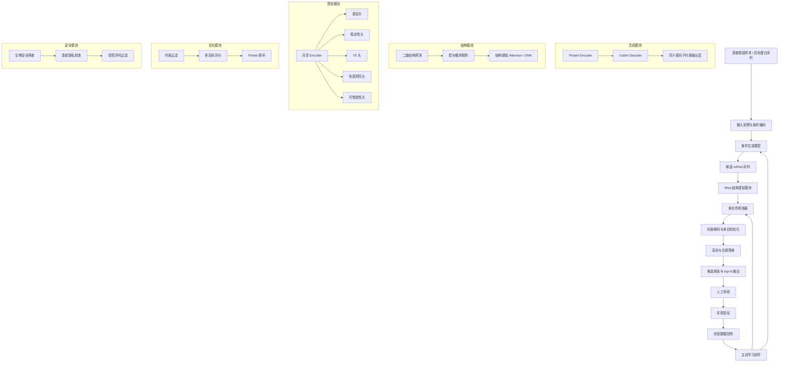

# mRNA 设计系统架构设计

## 生成模型 + 多任务预测 + 约束优化 + 主动学习

参考附件第3–11节，结合 Patient-mRNA Designer 的 PRD v0 与指标字典，给出完整架构设计。

---

# 一、总体架构图



---

# 二、模块详细设计

## 2.1 输入处理与条件编码

**输入**：
- 目标蛋白氨基酸序列
- 患者/物种/细胞类型/组织
- 修饰核苷酸（unmodified、m1Ψ、Ψ 等）
- 递送方式（LNP、电穿孔等）
- 目标权重（表达、稳定性、免疫、可制造性）
- 约束（GC 范围、同聚物、motif、酶切位点等）

**处理**：
- 校验蛋白序列，翻译为密码子约束。
- 将条件转换为 embedding：`[HOST=human]`、`[CELL=hepatocyte]`、`[MOD=m1Ψ]`、`[DELIVERY=LNP]`、`[GOAL=high_expression]`。
- 归一化权重，总和为 1。
- 生成 region annotation：5′UTR、CDS、3′UTR、polyA。

**输出**：模型可用的条件向量 + 约束列表。

---

## 2.2 条件生成模型

参考附件第4节。

**架构**：Encoder-Decoder Transformer。

```text
Protein Encoder: Transformer encoder，输入氨基酸序列
Codon Decoder: Transformer decoder，自回归生成同义密码子
输出层：同义密码子 mask，保证 translate(CDS) = target protein
```

**关键设计**：
- 密码子级 tokenization。
- 同义密码子约束：`logits[非当前氨基酸同义密码子] = -∞`。
- 相对位置编码：相对 start codon、stop codon、5′端。
- 区域 embedding：5′UTR、CDS、3′UTR、polyA。
- 条件控制：通过 cross-attention 或条件 token 注入。

**输出**：候选 CDS 序列。

---

## 2.3 RNA 结构感知模块

参考附件第5节。

**功能**：
- 计算 MFE、配对概率、可及性、5′端局部结构强度。
- 将配对概率矩阵作为 attention bias 注入 Transformer。
- 或使用 GNN 对碱基配对图编码，与序列分支融合。

**技术**：
- ViennaRNA / RNAfold / LinearFold / EternaFold 计算结构特征。
- Graph Transformer 或 GNN 处理结构图。
- 结构特征同时用于生成和预测。

**输出**：结构感知 embedding，供多任务预测器和约束优化使用。

---

## 2.4 多任务预测器

参考附件第6节。

**架构**：共享 Encoder + 多任务头。

```text
RNA sequence + region + condition
        ↓
Nucleotide Transformer / CNN-Transformer hybrid
        ↓
Shared representation
        ↓
表达头 / 稳定性头 / TE 头 / 免疫头 / 可制造性头
```

**任务**：
- 表达量回归（MSE / Huber）
- 半衰期回归
- 翻译效率回归
- 免疫风险分类（AUC）
- 可制造性回归
- 约束违反预测（辅助）

**输出**：每个候选的多维评分、不确定性估计。

---

## 2.5 约束解码与多目标优化

参考附件第7、8节。

**硬约束**：
- 翻译后蛋白一致
- 无内部终止密码子
- GC 40%–60%
- 同聚物 ≤4
- 避免指定 motif
- 避免限制性酶切位点
- 安全筛查通过

**软约束**：
- 避免强 5′端二级结构
- 避免局部极端 GC
- 避免稀有密码子聚集
- 避免重复序列
- 避免剪接样信号

**优化方法**：
- Constrained beam search
- Reward-guided decoding
- Pareto 排序（NSGA-II）
- 整数规划 / 模拟退火 / 遗传算法

**输出**：top-N Pareto 候选，附评分、约束报告、不确定性。

---

## 2.6 安全与合规模块

**功能**：
- 生物安全筛查：比对受控病原体、毒素、危险序列。
- 患者隐私：脱敏、加密、访问控制。
- 受控序列过滤：禁止生成危险序列。
- 审计日志：全流程可追溯。
- 人工审核门：所有最终候选必须经分子生物学家和临床医生审核。

---

## 2.7 主动学习闭环

参考附件第10节。

**流程**：
1. 模型生成候选。
2. 按不确定性 + 多样性选择待测序列。
3. 合成并实验验证。
4. 获得表达、稳定性、免疫、IVT 等标签。
5. 数据回传，更新预测器和生成器。
6. 迭代。

**技术**：
- 不确定性估计：MC Dropout、Deep Ensembles。
- 采样策略：BALD、Core-set、多样性采样。
- 实验数据管理：LIMS、MLflow、DVC。

---

# 三、技术选型

| 类别 | 推荐技术 | 说明 |
|---|---|---|
| 编程语言 | Python 3.11+ | 生态完善 |
| 深度学习 | PyTorch 2.x | 灵活，适合研究 |
| Transformer 库 | HuggingFace Transformers | 预训练模型、Tokenizer |
| 图神经网络 | PyTorch Geometric / DGL | 结构图建模 |
| RNA 结构 | ViennaRNA, RNAfold, LinearFold, EternaFold | MFE、配对概率 |
| 序列分析 | Biopython, scikit-bio | 序列处理 |
| 数据版本化 | DVC | 数据、模型版本 |
| 实验追踪 | MLflow / Weights & Biases | 指标、参数、模型 |
| 数据库 | PostgreSQL + MinIO | 结构化数据 + 对象存储 |
| 工作流 | Airflow / Prefect | 数据管道、训练管道 |
| API | FastAPI | 高性能 REST API |
| 部署 | Docker + Kubernetes | 容器化、弹性伸缩 |
| 模型服务 | TorchServe / Triton | 推理服务 |
| 安全筛查 | BLAST + 自定义规则 | 生物安全 |
| 前端 | React + TypeScript | 候选查看、审核界面 |
| 权限 | Keycloak / OAuth2 | 角色权限、审计 |
| 合规 | HIPAA/GDPR 工具链 | 隐私保护 |

---

# 四、风险清单

| 风险 | 类别 | 影响 | 概率 | 缓解措施 |
|---|---|---|---|---|
| 公开免疫/可制造性数据不足 | 数据 | 模型预测不准 | 高 | 尽早启动自有实验，规则近似 |
| 标签批次效应 | 数据 | 模型混淆序列与批次 | 高 | 保留 metadata，相对值/rank 归一化 |
| 长序列计算复杂度 | 技术 | 训练/推理慢 | 中 | Sparse/local attention，分层 Transformer |
| 生成模型违反蛋白约束 | 技术 | 候选无效 | 中 | 同义密码子 mask，翻译验证 |
| 结构预测不准 | 技术 | 预测偏差 | 中 | 集成多种工具，实验结构数据 |
| 安全筛查漏检 | 安全 | 合规风险 | 低 | 多引擎筛查，人工审核 |
| 患者隐私泄露 | 合规 | 法律风险 | 低 | 加密、脱敏、访问控制 |
| 实验周期长 | 实验 | 闭环延迟 | 高 | 并行多批实验，提前规划 |
| 模型过拟合 | 技术 | 泛化差 | 中 | 按基因/细胞划分，正则化 |
| 跨物种/细胞泛化差 | 技术 | 应用受限 | 中 | 条件控制，adapter，多物种数据 |
| 权重设置主观 | 产品 | 候选不符合预期 | 中 | 多目标 Pareto，用户可调权重 |
| 生产放大失败 | 制造 | 无法量产 | 中 | 可制造性预测，早期小试 |
| 监管路径不明 | 合规 | 上市延迟 | 高 | 早期与监管沟通，合规设计 |
| 人员技能不足 | 团队 | 进度延迟 | 中 | 培训，招聘，外部合作 |

---

# 五、总结

本架构以 **条件 Transformer 生成同义 CDS** 为核心，融合 **RNA 结构感知**、**多任务预测**、**约束解码与多目标优化**、**安全合规** 和 **主动学习闭环**。技术选型覆盖数据处理、模型训练、部署、安全和合规。风险清单识别了主要技术、数据、实验和合规风险，并给出缓解措施。

该架构可直接支撑 Patient-mRNA Designer 的 MVP 和后续迭代，确保生成候选满足蛋白正确性、稳定性、高表达、低免疫、可制造和安全合规的要求。