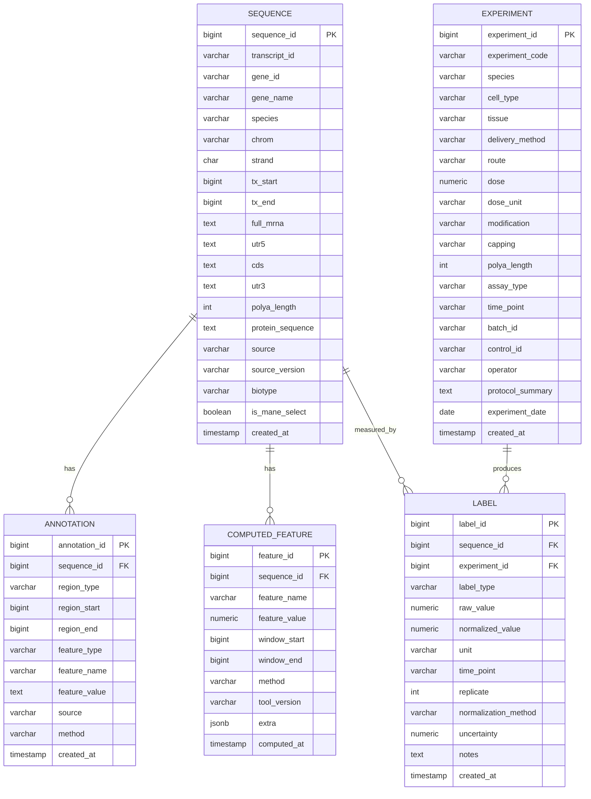

# mRNA 设计数据库 Schema 与 ER 图

基于 GENCODE 提取的序列数据，结合后续实验标签、注释和计算特征，设计以下 5 张核心表。整体关系：

```text
sequence（序列主表）
  ├── annotation（区域/功能注释）
  ├── computed_feature（计算特征）
  └── label（实验标签） ← experiment（实验元数据）
```

---

# 一、ER 图



---

# 二、DB Schema（PostgreSQL DDL）

## 2.1 sequence 表

存储从 GENCODE 提取的转录本序列、区域序列和蛋白序列。

```sql
CREATE TABLE sequence (
    sequence_id        BIGSERIAL PRIMARY KEY,
    transcript_id      VARCHAR(64)  NOT NULL,
    gene_id            VARCHAR(64)  NOT NULL,
    gene_name          VARCHAR(128),
    species            VARCHAR(32)  NOT NULL,
    chrom              VARCHAR(16),
    strand             CHAR(1),
    tx_start           BIGINT,
    tx_end             BIGINT,
    full_mrna          TEXT         NOT NULL,
    utr5               TEXT,
    cds                TEXT         NOT NULL,
    utr3               TEXT,
    polya_length       INTEGER,
    protein_sequence   TEXT         NOT NULL,
    biotype            VARCHAR(64)  DEFAULT 'protein_coding',
    source             VARCHAR(32)  DEFAULT 'GENCODE',
    source_version     VARCHAR(32),
    is_mane_select     BOOLEAN      DEFAULT FALSE,
    cds_length         INTEGER,
    utr5_length        INTEGER,
    utr3_length        INTEGER,
    created_at         TIMESTAMP    DEFAULT NOW(),
    CONSTRAINT uq_sequence_transcript UNIQUE (transcript_id, species, source_version),
    CONSTRAINT chk_strand CHECK (strand IN ('+', '-'))
);

CREATE INDEX idx_sequence_gene_id ON sequence(gene_id);
CREATE INDEX idx_sequence_species ON sequence(species);
CREATE INDEX idx_sequence_chrom ON sequence(chrom);
CREATE INDEX idx_sequence_biotype ON sequence(biotype);
CREATE INDEX idx_sequence_mane ON sequence(is_mane_select);
```

**字段说明**：

| 字段 | 说明 |
|---|---|
| `transcript_id` | GENCODE 转录本 ID，如 ENST00000456328 |
| `gene_id` | GENCODE 基因 ID，如 ENSG00000223972 |
| `full_mrna` | 拼接后的成熟 mRNA，RNA 字母表 A/U/G/C |
| `utr5` / `cds` / `utr3` | 各区域序列，负链已反向互补 |
| `polya_length` | poly(A) 尾长度，若无则为 NULL |
| `protein_sequence` | CDS 翻译后的蛋白序列 |
| `is_mane_select` | 是否为 MANE Select 代表转录本 |
| `source_version` | 如 GENCODE v49 |

---

## 2.2 annotation 表

存储区域边界、功能元件、motif 等注释。

```sql
CREATE TABLE annotation (
    annotation_id   BIGSERIAL PRIMARY KEY,
    sequence_id     BIGINT       NOT NULL,
    region_type     VARCHAR(32)  NOT NULL,
    region_start    BIGINT,
    region_end      BIGINT,
    feature_type    VARCHAR(64)  NOT NULL,
    feature_name    VARCHAR(128),
    feature_value   TEXT,
    source          VARCHAR(64),
    method          VARCHAR(64),
    created_at      TIMESTAMP    DEFAULT NOW(),
    CONSTRAINT fk_annotation_sequence
        FOREIGN KEY (sequence_id) REFERENCES sequence(sequence_id)
        ON DELETE CASCADE,
    CONSTRAINT chk_region_type
        CHECK (region_type IN ('5UTR', 'CDS', '3UTR', 'polyA', 'full_mrna', 'other'))
);

CREATE INDEX idx_annotation_sequence ON annotation(sequence_id);
CREATE INDEX idx_annotation_region ON annotation(region_type);
CREATE INDEX idx_annotation_feature ON annotation(feature_type);
```

**feature_type 典型取值**：

| feature_type | 说明 | 示例 |
|---|---|---|
| `uORF` | 上游开放阅读框 | 5′UTR 中的 AUG...stop |
| `uAUG` | 上游起始密码子 | 位置、Kozak 上下文 |
| `Kozak` | Kozak 序列 | GCCACCATGG |
| `miRNA_site` | miRNA 结合位点 | miR-21 seed match |
| `ARE` | AU-rich element | AUUUA 重复 |
| `RBP_motif` | RNA 结合蛋白 motif | PUM1、HuR |
| `polyA_signal` | polyadenylation 信号 | AAUAAA |
| `splice_site` | 剪接位点 | 5′/3′ splice site |
| `restriction_site` | 限制性酶切位点 | EcoRI、BamHI |
| `homopolymer` | 同聚物区段 | AAAAAA |
| `repeat` | 重复序列 | 简单重复、串联重复 |
| `exon_boundary` | 外显子边界 | 用于剪接分析 |

---

## 2.3 experiment 表

存储实验元数据。**这是标签可解释性的关键**，同一序列在不同实验条件下表现不同。

```sql
CREATE TABLE experiment (
    experiment_id      BIGSERIAL PRIMARY KEY,
    experiment_code    VARCHAR(64)  NOT NULL UNIQUE,
    species            VARCHAR(32)  NOT NULL,
    cell_type          VARCHAR(64),
    tissue             VARCHAR(64),
    delivery_method    VARCHAR(64),
    route              VARCHAR(64),
    dose               NUMERIC(12,4),
    dose_unit          VARCHAR(32),
    modification       VARCHAR(32)  DEFAULT 'unmodified',
    capping            VARCHAR(32),
    polya_length       INTEGER,
    assay_type         VARCHAR(64)  NOT NULL,
    time_point         VARCHAR(32),
    batch_id           VARCHAR(64),
    control_id         VARCHAR(64),
    operator           VARCHAR(64),
    protocol_summary   TEXT,
    experiment_date    DATE,
    created_at         TIMESTAMP    DEFAULT NOW(),
    CONSTRAINT chk_modification
        CHECK (modification IN ('unmodified', 'm1Ψ', 'Ψ', '5mC', 'm6A', 'other'))
);

CREATE INDEX idx_experiment_cell ON experiment(cell_type);
CREATE INDEX idx_experiment_assay ON experiment(assay_type);
CREATE INDEX idx_experiment_batch ON experiment(batch_id);
CREATE INDEX idx_experiment_mod ON experiment(modification);
```

**assay_type 典型取值**：

| assay_type | 说明 | 产出标签 |
|---|---|---|
| `luciferase` | 荧光素酶报告 | 表达量 |
| `ELISA` | 蛋白定量 | 表达量 |
| `Western` | 蛋白印迹 | 表达量 |
| `flow` | 流式细胞术 | 表达量、MFI |
| `MS` | 质谱 | 蛋白丰度 |
| `RNA-seq` | RNA 测序 | mRNA 丰度 |
| `Ribo-seq` | 核糖体印迹 | TE、核糖体密度 |
| `polysome` | 多聚核糖体分析 | TE |
| `half_life` | 半衰期测定 | 半衰期、降解率 |
| `cytokine` | 细胞因子检测 | 免疫激活 |
| `IVT` | 体外转录 | 产率、全长比例 |
| `HPLC` | 高效液相 | 纯度、加帽效率 |

---

## 2.4 label 表

存储实验测量值，是监督学习的核心标签。

```sql
CREATE TABLE label (
    label_id             BIGSERIAL PRIMARY KEY,
    sequence_id          BIGINT       NOT NULL,
    experiment_id        BIGINT       NOT NULL,
    label_type           VARCHAR(64)  NOT NULL,
    raw_value            NUMERIC(18,6),
    normalized_value     NUMERIC(18,6),
    unit                 VARCHAR(32),
    time_point           VARCHAR(32),
    replicate            INTEGER,
    normalization_method VARCHAR(64),
    uncertainty          NUMERIC(12,6),
    notes                TEXT,
    created_at           TIMESTAMP    DEFAULT NOW(),
    CONSTRAINT fk_label_sequence
        FOREIGN KEY (sequence_id) REFERENCES sequence(sequence_id)
        ON DELETE CASCADE,
    CONSTRAINT fk_label_experiment
        FOREIGN KEY (experiment_id) REFERENCES experiment(experiment_id)
        ON DELETE CASCADE
);

CREATE INDEX idx_label_sequence ON label(sequence_id);
CREATE INDEX idx_label_experiment ON label(experiment_id);
CREATE INDEX idx_label_type ON label(label_type);
CREATE INDEX idx_label_seq_type ON label(sequence_id, label_type);
```

**label_type 典型取值**：

| label_type | 说明 | 单位 | 方向 |
|---|---|---|---|
| `protein_expression` | 蛋白表达量 | 相对值/倍数 | 越高越好 |
| `expression_auc` | 表达曲线 AUC | 相对值·h | 越高越好 |
| `mrna_abundance` | mRNA 丰度 | RPKM/TPM | 越高越好 |
| `mrna_half_life` | mRNA 半衰期 | 小时 | 越高越好 |
| `decay_rate` | 降解速率 | h⁻¹ | 越低越好 |
| `translation_efficiency` | 翻译效率 | 比值 | 越高越好 |
| `ribosome_density` | 核糖体密度 | RPKM | 越高越好 |
| `immune_activation` | 免疫激活分数 | 分数 | 越低越好 |
| `ifn_beta` | IFN-β 诱导 | 倍数 | 越低越好 |
| `il6` | IL-6 分泌 | pg/mL | 越低越好 |
| `cell_viability` | 细胞活力 | % | 越高越好 |
| `ivt_yield` | IVT 产率 | mg/mL | 越高越好 |
| `full_length_fraction` | 全长比例 | % | 越高越好 |
| `dsrna_impurity` | dsRNA 杂质 | ng/µg | 越低越好 |
| `capping_efficiency` | 加帽效率 | % | 越高越好 |

**normalization_method 典型取值**：

- `none`：原始值
- `relative_to_control`：相对阳性对照
- `zscore_within_batch`：批次内 z-score
- `rank_within_batch`：批次内排名
- `percentile`：百分位
- `log2`：对数转换
- `quantile`：分位数归一化

---

## 2.5 computed_feature 表

存储计算特征，供模型输入和约束优化使用。

```sql
CREATE TABLE computed_feature (
    feature_id      BIGSERIAL PRIMARY KEY,
    sequence_id     BIGINT       NOT NULL,
    feature_name    VARCHAR(64)  NOT NULL,
    feature_value   NUMERIC(18,6),
    window_start    BIGINT,
    window_end      BIGINT,
    method          VARCHAR(64),
    tool_version    VARCHAR(64),
    extra           JSONB,
    computed_at     TIMESTAMP    DEFAULT NOW(),
    CONSTRAINT fk_feature_sequence
        FOREIGN KEY (sequence_id) REFERENCES sequence(sequence_id)
        ON DELETE CASCADE
);

CREATE INDEX idx_feature_sequence ON computed_feature(sequence_id);
CREATE INDEX idx_feature_name ON computed_feature(feature_name);
CREATE INDEX idx_feature_seq_name ON computed_feature(sequence_id, feature_name);
```

**feature_name 典型取值**：

| 类别 | feature_name | 说明 |
|---|---|---|
| 组成 | `gc_content` | 全局 GC |
| 组成 | `gc_window` | 滑动窗口 GC |
| 组成 | `cai` | 密码子适应指数 |
| 组成 | `tai` | tRNA 适应指数 |
| 组成 | `codon_pair_bias` | 密码子对偏好 |
| 组成 | `cpg_frequency` | CpG 频率 |
| 组成 | `upa_frequency` | UpA 频率 |
| 组成 | `homopolymer_max` | 最长同聚物 |
| 组成 | `repeat_score` | 重复评分 |
| 结构 | `mfe` | 最小自由能 |
| 结构 | `mfe_window` | 局部 MFE |
| 结构 | `five_prime_mfe` | 5′端局部 MFE |
| 结构 | `pairing_prob` | 配对概率 |
| 结构 | `accessibility` | 可及性 |
| 结构 | `unpaired_prob` | 未配对概率 |
| UTR | `uorf_count` | uORF 数量 |
| UTR | `uaug_count` | uAUG 数量 |
| UTR | `kozak_score` | Kozak 强度 |
| UTR | `mirna_site_count` | miRNA 位点数 |
| UTR | `are_count` | ARE 数量 |
| UTR | `rbp_motif_count` | RBP motif 数 |
| 安全 | `restriction_site_count` | 限制性位点数 |
| 安全 | `splice_site_score` | 剪接样信号评分 |
| 安全 | `biosecurity_pass` | 生物安全通过 |

`extra` JSONB 用于存储额外信息，例如：

```json
{
  "base_pairs": [{"i": 12, "j": 86, "prob": 0.34}],
  "top_motifs": ["AUUUA", "GGGAAA"],
  "tool_params": {"temperature": 37, "salt": "1M NaCl"}
}
```

---

# 三、典型查询示例

## 3.1 获取某转录本的完整信息

```sql
SELECT s.transcript_id, s.gene_name, s.full_mrna,
       s.protein_sequence, s.cds_length
FROM sequence s
WHERE s.transcript_id = 'ENST00000456328.2';
```

## 3.2 获取某序列的所有特征

```sql
SELECT feature_name, feature_value, window_start, window_end
FROM computed_feature
WHERE sequence_id = 1
ORDER BY feature_name, window_start;
```

## 3.3 获取某序列在特定条件下的表达标签

```sql
SELECT l.label_type, l.raw_value, l.normalized_value, l.unit,
       e.cell_type, e.modification, e.delivery_method, e.time_point
FROM label l
JOIN experiment e ON l.experiment_id = e.experiment_id
WHERE l.sequence_id = 1
  AND l.label_type = 'protein_expression'
  AND e.cell_type = 'HEK293T'
  AND e.modification = 'm1Ψ';
```

## 3.4 获取某蛋白的所有同义 CDS 变体

```sql
SELECT s.transcript_id, s.cds, s.gc_content
FROM sequence s
WHERE s.protein_sequence = 'MKT...'
  AND s.species = 'human';
```

## 3.5 构建训练样本（序列表 + 标签）

```sql
SELECT s.transcript_id, s.full_mrna, s.protein_sequence,
       l.label_type, l.normalized_value,
       e.cell_type, e.modification, e.assay_type
FROM sequence s
JOIN label l ON s.sequence_id = l.sequence_id
JOIN experiment e ON l.experiment_id = e.experiment_id
WHERE l.label_type IN ('protein_expression', 'mrna_half_life')
  AND e.assay_type = 'luciferase';
```

---

# 四、数据关系总结

| 关系 | 基数 | 说明 |
|---|---|---|
| sequence → annotation | 1:N | 一条序列有多个区域/功能注释 |
| sequence → computed_feature | 1:N | 一条序列有多个计算特征 |
| sequence → label | 1:N | 一条序列在多个实验中被测量 |
| experiment → label | 1:N | 一次实验产生多个标签 |
| sequence ↔ experiment | M:N | 通过 label 表关联 |

**关键设计原则**：

1. **序列与实验分离**：同一序列可在不同实验条件下测量，避免标签混淆。
2. **标签归一化字段**：`raw_value` 和 `normalized_value` 并存，保留原始数据和可比数据。
3. **metadata 完整**：experiment 表记录细胞、修饰、递送、批次等，保证标签可解释。
4. **特征窗口化**：computed_feature 支持全局和局部特征，`window_start/end` 可空表示全局。
5. **可追溯**：所有表含 `created_at`，特征表含 `method` 和 `tool_version`，保证可复现。
6. **级联删除**：删除序列时自动删除其注释、特征和标签，保持一致性。

---

# 五、扩展建议

- **样本表**：若需管理患者样本，可增加 `patient` 和 `sample` 表，与 experiment 关联。
- **模型版本表**：增加 `model_version` 表，记录生成器和预测器的版本、训练数据、指标。
- **候选表**：增加 `candidate` 表，存储模型生成的候选序列、评分、审核状态。
- **审核表**：增加 `review` 表，记录人工审核意见、审核人、时间。
- **安全筛查表**：增加 `safety_screen` 表，记录每次筛查的规则、结果、证据。

以上 5 张核心表可直接支撑从 GENCODE 数据准备到模型训练、实验闭环的全流程。